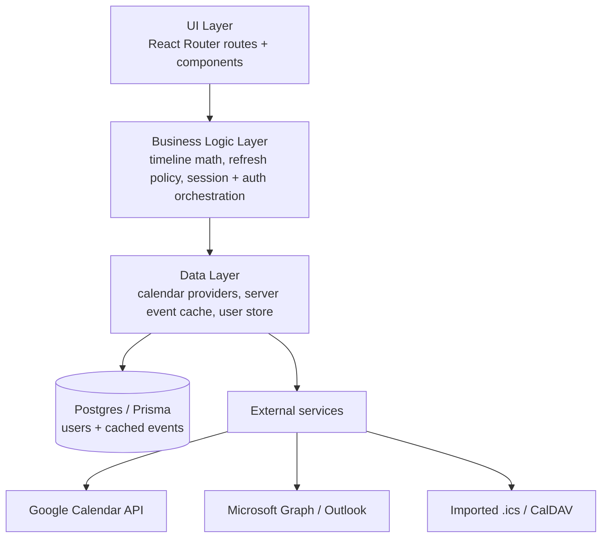
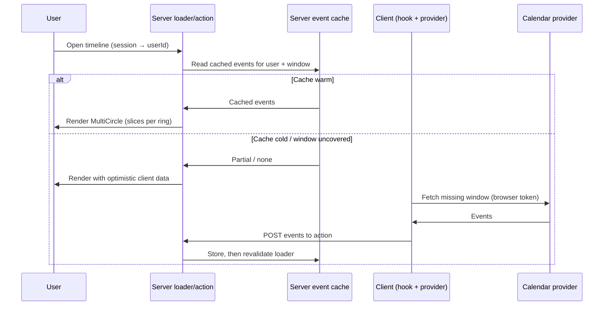

# Architecture

This document describes the architecture of the web app. The three-layer separation it sets out is in place across the codebase; new work lands within this structure rather than being retrofitted later.

The design carries over the three-layer separation from the original app's [architecture notes](https://github.com/MiikaNiemela/circular-time-app/blob/main/docs/architecture/architecture.md) and adapts it to React Router v7, vanilla-extract, and Storybook.

## Core principles

- **Server-authoritative cache.** The timeline renders from a per-user event cache on the server, read through a route loader. The browser only calls provider APIs to warm a cold cache, then hands the result back to the server. Past data is never discarded automatically.
- **Identity before persistence.** A signed session maps each request to a stable user ID, so server-side data is keyed per user rather than per device.
- **Clear layer boundaries.** UI components never talk to calendar APIs directly; they go through a data layer.
- **Component isolation.** Every UI component is buildable and testable in Storybook with no app context.
- **Extraction-ready core.** The circular timeline is designed so it can be lifted into a standalone library with minimal change (see [issue #2](https://github.com/MiikaNiemela/circular-time-app/issues/2)).
- **Responsive by default.** Components size to their container; the app adapts from phone to large desktop.

## Layers

The three layers and their boundaries are unchanged; the server-side work added to identity and caching lands inside the existing Business Logic and Data layers rather than introducing a new one.

**UI layer.** React Router routes (sign-in, timeline, settings, OAuth callbacks) and presentational components. The centrepiece is the circular timeline component, which is purely presentational: given slices, it draws them. It holds no knowledge of calendars. The timeline route reads its events from a server `loader` rather than fetching on render.

**Business logic layer.** Converts calendar events into slices for a given view (day/week/month/year), positions them chronologically from the 12 o'clock origin, and applies the refresh policy (past = manual refresh only; future-within-a-day = auto) — the same policy runs server-side to fetch only the windows the cache doesn't already cover. It also orchestrates authentication and resolves identity: a signed, HTTP-only session cookie maps each request to a stable user ID, anchoring server-side data to a user rather than a device.

**Data layer.** A provider per source (Google, Outlook, imported calendars) behind a common interface, plus two repository-backed stores on Postgres/Prisma: the server-side event cache (keyed by user + provider + time range) and the user store (linked provider accounts). The server cache is the source of truth the UI reads from; the browser-side provider fetch exists only to populate it.

## Component model (timeline core)

Ported and hardened from the React Native `circle.tsx`:

- **`Slice`** — the atomic unit: a `color` and a size in `degrees`. It deliberately carries no event metadata or identity; that lives in the mapping layer ([decisions/timeline-api.md](decisions/timeline-api.md)), keeping the visual core decoupled from the data layer.
- **`Circle`** — renders one ring: an array of `Slice`s as SVG arc paths, with a configurable `lineWidth` (ring thickness). Angles are computed with trig; a slice over 180° sets the SVG large-arc flag.
- **`MultiCircle`** — composes several `Circle`s concentrically, each centred within the largest, to show multiple schedules on one timeline.

The API questions tracked in issue #2 are resolved in [decisions/timeline-api.md](decisions/timeline-api.md):

- `MultiCircleProps` stays a flat array of rings (`RingConfig[]`); calendar identity and event metadata live in the mapping layer, not the slice model.
- Interactivity is part of the API: an optional `onSliceClick` turns slices into keyboard-accessible buttons, and is purely presentational when omitted.
- `Circle`, `MultiCircle`, and `Slice` are exported from a single `index.ts` entry point, making the future package boundary explicit.

## Data flow: rendering the timeline

The loader serves from the server cache; a cold cache is warmed by a one-time client fetch that posts results back through the route action, after which React Router revalidates the loader.

## Styling & theming

vanilla-extract provides type-safe, zero-runtime CSS, organised as a two-tier token system. Tier-1 *primitives* (`app/styles/primitives.ts`) hold the raw palette and the spacing/typography/radius scales in one place; tier-2 *semantic* tokens (`theme.css.ts`) name them by role (`background`, `text`, `accent`, …), and the light and dark themes alias primitives onto those roles. Components reference semantic tokens only — no raw values inlined. The SVG timeline scales to its container so the same component serves a phone and a wall-sized display.

## Hosting

The application runs as a Node.js SSR server through `react-router-serve` in a container platform.

- The container listens on `PORT=8080`.
- A multi-stage Dockerfile (`deps → builder → runner`) retains the compiled `build/` output and production dependencies in the final image.
- The runner stage uses a non-root system user (`reactrouter`).
- Runtime credentials and connection settings are injected by the deployment environment. They are never stored in the image or source repository.
- OAuth providers require an environment-specific stable redirect URI to be registered before sign-in is enabled.

### Persistence

User records and cached calendar events live in a PostgreSQL database through Prisma and `@prisma/adapter-pg`. The deployment environment supplies `DATABASE_URL` and `SESSION_SECRET`; neither value is baked into an image. Business logic reaches the database only through repository interfaces, so the concrete driver remains replaceable.

### Google OAuth

Google's web OAuth client uses a confidential client secret for its server-side token exchange. The browser never receives that secret. The `/auth/google/token` route retrieves it through the runtime environment's secret-management integration, and caches it in-process for each container instance.

The deployment environment supplies the public Google client ID separately. The public client ID is included in the browser build; the client secret remains server-side.

### Outlook OAuth

Microsoft's identity platform supports a public SPA client. The browser performs the authorization-code and PKCE token exchange directly, with no client secret.

The Outlook app registration must define the environment's callback under the Single-page application platform and grant the delegated calendar, offline-access, OpenID, and profile permissions used by the application. The public Outlook client ID is supplied as build configuration.

## Testing strategy

- **Unit tests** accompany every component and logic module (timeline math is highly testable: arc counts, `lineWidth` handling, the full-360° case, `MultiCircle` centering offsets, SVG dimensions).
- **Storybook** is the visual workbench and the home for interaction/visual checks.
- A feature is not "done" until it has tests and a story where it is a component.
