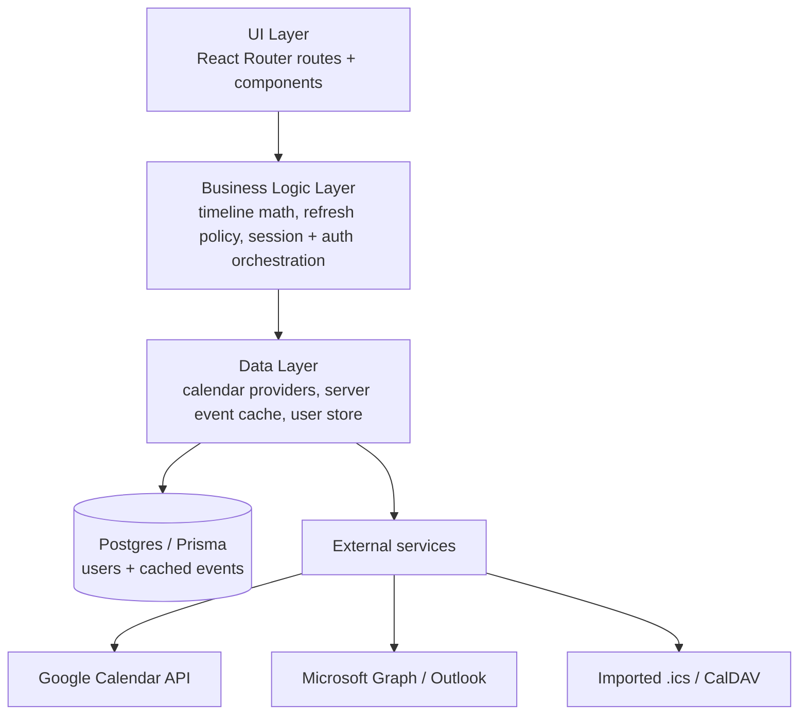
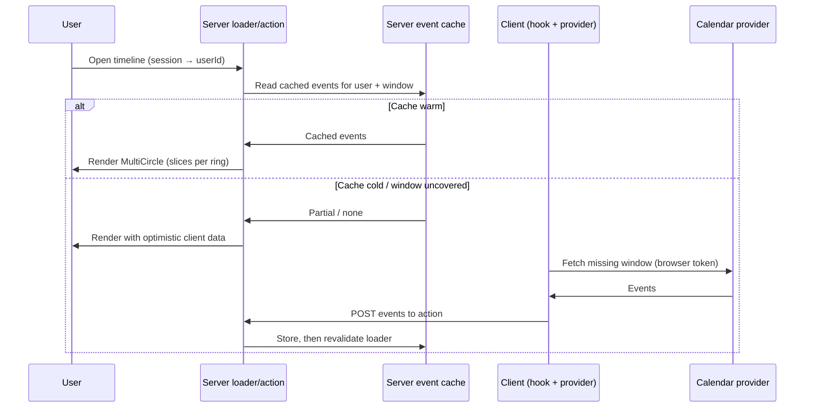

# Architecture

This document describes the architecture of the web app. The three-layer separation it sets out is in place across the codebase; new work lands within this structure rather than being retrofitted later.

The design carries over the three-layer separation from the original app's [architecture notes](https://github.com/MiikaNiemela/circular-time-app/blob/main/docs/architecture/architecture.md) and adapts it to React Router v7, vanilla-extract, and Storybook.

## Core principles

- **Server-authoritative cache.** The timeline renders from a per-user event cache on the server, read through a route loader. The browser only calls provider APIs to warm a cold cache, then hands the result back to the server. Past data is never discarded automatically.
- **Identity before persistence.** A signed session maps each request to a stable user ID, so server-side data is keyed per user rather than per device.
- **Clear layer boundaries.** UI components never talk to calendar APIs directly; they go through a data layer.
- **Component isolation.** Every UI component is buildable and testable in Storybook with no app context.
- **Extraction-ready core.** The circular timeline is designed so it can be lifted into a standalone library with minimal change (see [issue #2](https://github.com/MiikaNiemela/circular-time-app/issues/2)).
- **Responsive by default.** Components size to their container; the app adapts from phone to large desktop.

## Layers



The three layers and their boundaries are unchanged; the server-side work added to identity and caching lands inside the existing Business Logic and Data layers rather than introducing a new one.

**UI layer.** React Router routes (sign-in, timeline, settings, OAuth callbacks) and presentational components. The centrepiece is the circular timeline component, which is purely presentational: given slices, it draws them. It holds no knowledge of calendars. The timeline route reads its events from a server `loader` rather than fetching on render.

**Business logic layer.** Converts calendar events into slices for a given view (day/week/month/year), positions them chronologically from the 12 o'clock origin, and applies the refresh policy (past = manual refresh only; future-within-a-day = auto) — the same policy runs server-side to fetch only the windows the cache doesn't already cover. It also orchestrates authentication and resolves identity: a signed, HTTP-only session cookie maps each request to a stable user ID, anchoring server-side data to a user rather than a device.

**Data layer.** A provider per source (Google, Outlook, imported calendars) behind a common interface, plus two repository-backed stores on Postgres/Prisma: the server-side event cache (keyed by user + provider + time range) and the user store (linked provider accounts). The server cache is the source of truth the UI reads from; the browser-side provider fetch exists only to populate it.

## Component model (timeline core)

Ported and hardened from the React Native `circle.tsx`:

- **`Slice`** — the atomic unit: a `color` and a size in `degrees`. It deliberately carries no event metadata or identity; that lives in the mapping layer ([decisions/timeline-api.md](decisions/timeline-api.md)), keeping the visual core decoupled from the data layer.
- **`Circle`** — renders one ring: an array of `Slice`s as SVG arc paths, with a configurable `lineWidth` (ring thickness). Angles are computed with trig; a slice over 180° sets the SVG large-arc flag.
- **`MultiCircle`** — composes several `Circle`s concentrically, each centred within the largest, to show multiple schedules on one timeline.

The API questions tracked in issue #2 are resolved in [decisions/timeline-api.md](decisions/timeline-api.md):

- `MultiCircleProps` stays a flat array of rings (`RingConfig[]`); calendar identity and event metadata live in the mapping layer, not the slice model.
- Interactivity is part of the API: an optional `onSliceClick` turns slices into keyboard-accessible buttons, and is purely presentational when omitted.
- `Circle`, `MultiCircle`, and `Slice` are exported from a single `index.ts` entry point, making the future package boundary explicit.

## Data flow: rendering the timeline

The loader serves from the server cache; a cold cache is warmed by a one-time client fetch that posts results back through the route action, after which React Router revalidates the loader.



## Styling & theming

vanilla-extract provides type-safe, zero-runtime CSS, organised as a two-tier token system. Tier-1 *primitives* (`app/styles/primitives.ts`) hold the raw palette and the spacing/typography/radius scales in one place; tier-2 *semantic* tokens (`theme.css.ts`) name them by role (`background`, `text`, `accent`, …), and the light and dark themes alias primitives onto those roles. Components reference semantic tokens only — no raw values inlined. The SVG timeline scales to its container so the same component serves a phone and a wall-sized display.

## Hosting

The app runs as a Node.js SSR server (via `react-router-serve`) on **Google Cloud Run**.

- The container listens on `PORT=8080` (Cloud Run's expected default).
- A multi-stage Dockerfile (`deps → builder → runner`) keeps the production image lean: dev tooling and the Vite build pipeline are discarded; only the compiled `build/` output and production `node_modules` are copied into the final stage.
- The runner stage uses a non-root system user (`reactrouter`) for least-privilege execution.
- `NODE_ENV=production` is baked in; secrets and OAuth credentials are injected at deploy time via Cloud Run environment variables or Secret Manager — never stored in the image.
- Because milestone 3 (Google Calendar / Outlook OAuth) requires a stable redirect URI, the Cloud Run service URL must be registered in each OAuth app's allowed redirect list before auth is wired.

### Persistence (Postgres)

User records and cached calendar events live in a PostgreSQL database, reached through Prisma (with the `@prisma/adapter-pg` driver). The connection string is injected at deploy time via the `DATABASE_URL` environment variable — never baked into the image — and the server reuses a single client across requests. Business logic talks to the database only through repository interfaces (`userRepository`, `serverEventCache`), so the concrete driver stays swappable. `SESSION_SECRET` signs the session cookie and must likewise be set in production.

### Google OAuth client secret (Secret Manager)

Google "Web application" OAuth clients are confidential: the token exchange requires a `client_secret` even when PKCE is used. The browser must never hold it, so the exchange is proxied server-side through the `/auth/google/token` resource route, which fetches the secret from **GCP Secret Manager** at runtime (`app/data/providers/google/secretManager.server.ts`) using the Cloud Run service account's own identity — no API key or env var holds the secret value.

One-time operator setup (per environment):

1. Store the OAuth client secret in Secret Manager under the secret id `OAUTH_CLIENT_SECRET` in project `683033464752`:

   ```bash
   printf '%s' "<client-secret>" | \
     gcloud secrets create OAUTH_CLIENT_SECRET --data-file=- --project=dev-circular-time
   # to rotate later: gcloud secrets versions add OAUTH_CLIENT_SECRET --data-file=-
   ```

2. Grant the Cloud Run runtime service account permission to read it:

   ```bash
   gcloud secrets add-iam-policy-binding OAUTH_CLIENT_SECRET \
     --member="serviceAccount:<cloud-run-runtime-sa>" \
     --role="roles/secretmanager.secretAccessor" \
     --project=dev-circular-time
   ```

The module reads `projects/683033464752/secrets/OAUTH_CLIENT_SECRET/versions/latest` and caches the value in-process, so each container makes at most one Secret Manager RPC per cold start. The deploy workflow no longer passes a `GOOGLE_CLIENT_SECRET` env var — only the public `GOOGLE_CLIENT_ID`.

### Outlook OAuth (Azure app registration)

Microsoft's identity platform supports true public SPA clients — the browser exchanges the authorization code for tokens directly, with no server secret involved. **No proxy route and no Secret Manager entry are needed for Outlook.**

The critical requirement is that the redirect URI is registered under the **Single-page application** platform in Azure (not "Web"). Microsoft only allows the browser-based, secretless PKCE token exchange — with the required CORS headers — for SPA-platform redirect URIs. Registering under "Web" would reject the browser's token request and demand a `client_secret`, undermining the whole point of public-client PKCE.

One-time operator setup (per environment):

1. In the [Microsoft Entra admin center](https://entra.microsoft.com), go to **App registrations → New registration**.
   - Name: anything (e.g. `circular-time-dev`)
   - Supported account types: *Accounts in any organizational directory and personal Microsoft accounts* (the `common` tenant, already used in `auth.ts`)
   - Skip the redirect URI here — add it in the next step.

2. Under **Authentication → Add a platform → Single-page application**, add the redirect URI:

   ```text
   https://dev.rjpnt.com/auth/outlook/callback
   ```

   Add `http://localhost:5173/auth/outlook/callback` for local development if needed.

3. Under **API permissions → Add a permission → Microsoft Graph → Delegated**, add:
   - `Calendars.Read`
   - `offline_access`
   - `openid`
   - `profile`

   These match `CALENDAR_SCOPE` in `app/data/providers/outlook/auth.ts`. Grant admin consent if your tenant requires it.

4. Copy the **Application (client) ID** from the app registration's Overview page and store it as the `VITE_OUTLOOK_CLIENT_ID` GitHub Actions secret. The deploy workflow already injects it as a Vite build-time variable; `isOutlookConfigured()` gates the Settings UI on it, so the "Connect Outlook" entry point appears automatically once the secret is set.

No `VITE_OUTLOOK_CLIENT_SECRET` secret is needed or used — Outlook's public-client PKCE requires only the client ID.

## Testing strategy

- **Unit tests** accompany every component and logic module (timeline math is highly testable: arc counts, `lineWidth` handling, the full-360° case, `MultiCircle` centering offsets, SVG dimensions).
- **Storybook** is the visual workbench and the home for interaction/visual checks.
- A feature is not "done" until it has tests and a story where it is a component.
