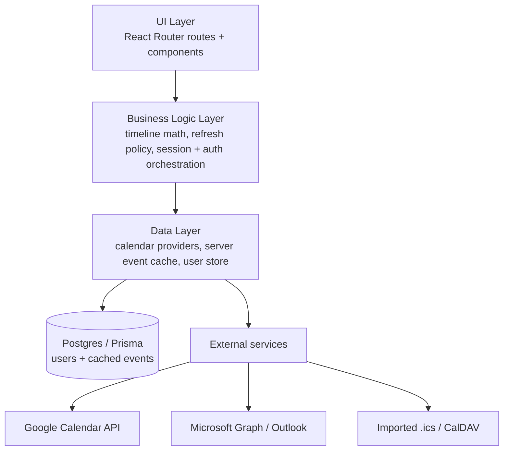
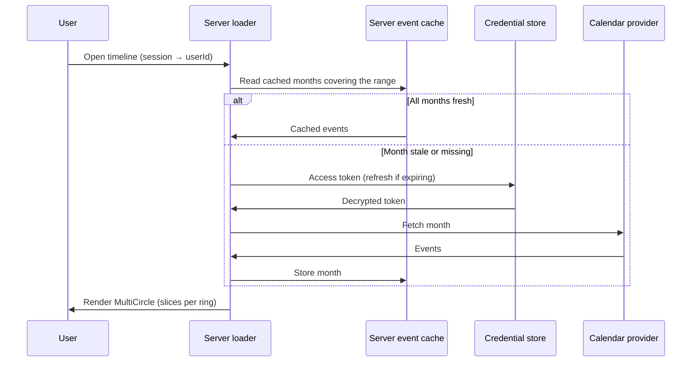

# Architecture

This document describes the architecture of the web app. The three-layer separation it sets out is in place across the codebase; new work lands within this structure rather than being retrofitted later.

The design carries over the three-layer separation from the original app's [architecture notes](https://github.com/MiikaNiemela/circular-time-app/blob/main/docs/architecture/architecture.md) and adapts it to React Router v7, vanilla-extract, and Storybook.

## Core principles

- **Server-authoritative cache.** The timeline renders from a per-user event cache on the server, read through a route loader. The server fetches missing or stale windows from the provider with the account's stored credentials. Past data is never discarded automatically.
- **Server-side credential custody.** The server runs the OAuth flows and holds provider tokens, encrypted in the database. The browser never receives a provider token or client secret.
- **Identity before persistence.** A server-side session maps each request to a stable user ID, so server-side data is keyed per user rather than per device.
- **Clear layer boundaries.** UI components never talk to calendar APIs directly; they go through a data layer.
- **Component isolation.** Every UI component is buildable and testable in Storybook with no app context.
- **Extraction-ready core.** The circular timeline is designed so it can be lifted into a standalone library with minimal change (see [issue #2](https://github.com/MiikaNiemela/circular-time-app/issues/2)).
- **Responsive by default.** Components size to their container; the app adapts from phone to large desktop.

## Layers


```mermaid
graph TB
    UI[UI Layer<br/>React Router routes + components] --> BL[Business Logic Layer<br/>timeline math, refresh policy, session + auth orchestration]
    BL --> DL[Data Layer<br/>calendar providers, server event cache, user store]
    DL --> SC[(Postgres / Prisma<br/>users + cached events)]
    DL --> EXT[External services]
    EXT --> GC[Google Calendar API]
    EXT --> OC[Microsoft Graph / Outlook]
    EXT --> ICS[Imported .ics / CalDAV]
```

The three layers and their boundaries are unchanged; the server-side work added to identity and caching lands inside the existing Business Logic and Data layers rather than introducing a new one.

**UI layer.** React Router routes (sign-in, timeline, settings, OAuth callbacks) and presentational components. The centrepiece is the circular timeline component, which is purely presentational: given slices, it draws them. It holds no knowledge of calendars. The timeline route reads its events from a server `loader` rather than fetching on render.

**Business logic layer.** Converts calendar events into slices for a given view (day/week/month/year), positions them chronologically from the 12 o'clock origin, and applies the refresh policy (past = manual refresh only; future-within-a-day = auto once the cached copy is 15 minutes old) — the same policy runs server-side to fetch only the months the cache doesn't already hold fresh. It also orchestrates authentication and resolves identity. The server runs each OAuth flow end to end and keeps the provider tokens of connected calendars, encrypted with AES-256-GCM and bound to their user and connection, refreshing them when they expire. A signed, HTTP-only cookie carries an opaque session token that the server resolves to a stable user ID on each request, anchoring server-side data to a user rather than a device. Sessions are stored server-side, so signing out revokes them.

**Data layer.** A provider per source (Google, Outlook, imported calendars) behind a common interface, plus repository-backed stores on Postgres/Prisma: the server-side event cache (keyed by user + provider + time range), the user store (application sign-in identities, of which an account may link one per provider, and separate calendar connections), and encrypted calendar credentials. Each cached range and credential is linked to an active calendar connection, so the database removes them when that connection is deleted. The server cache is the source of truth the UI reads from.

## Component model (timeline core)

Ported and hardened from the React Native `circle.tsx`:

- **`Slice`** — the atomic unit: a `color` and a size in `degrees`. It deliberately carries no event metadata or identity; that lives in the mapping layer ([decisions/timeline-api.md](decisions/timeline-api.md)), keeping the visual core decoupled from the data layer.
- **`Circle`** — renders one ring: an array of `Slice`s as SVG arc paths, with a configurable `lineWidth` (ring thickness). Angles are computed with trig; a slice over 180° sets the SVG large-arc flag.
- **`MultiCircle`** — composes several `Circle`s concentrically, each centred within the largest, to show multiple schedules on one timeline.

The API questions tracked in issue #2 are resolved in [decisions/timeline-api.md](decisions/timeline-api.md):

- `MultiCircleProps` stays a flat array of rings (`RingConfig[]`); calendar identity and event metadata live in the mapping layer, not the slice model.
- Interactivity is part of the API: an optional `onSliceClick` turns slices into keyboard-accessible buttons, and is purely presentational when omitted.
- `Circle`, `MultiCircle`, and `Slice` are exported from a single `index.ts` entry point, making the future package boundary explicit.

## Data flow: rendering the timeline

The loader reads each connected calendar through the server cache, which stores whole UTC calendar months. Every view reads the months that cover its range, so the day, week, month, and year views share cache entries. Fresh months come from the database; stale or missing ones are fetched from the provider with the account's stored credentials and cached. The loader returns only the events that overlap the requested range. A month is stored only after every result page has been read: the Google and Outlook providers follow `nextPageToken` and `@odata.nextLink`, and they fail instead of returning a partial list. Outlook next links outside Microsoft Graph are rejected, so the access token goes only to Graph. An event that spans a month boundary is held by both months, which can be fetched at different times because a past month is not refreshed automatically. If a more recently fetched month holds a different version of the event, or no longer holds it, the older month is fetched again. Copies are merged by fetch time, so an edited or deleted event is not served from the older month. When a calendar cannot be read, the loader serves what is cached and the page prompts a reconnect.


```mermaid
sequenceDiagram
    participant U as User
    participant L as Server loader
    participant DB as Server event cache
    participant CR as Credential store
    participant API as Calendar provider

    U->>L: Open timeline (session → userId)
    L->>DB: Read cached months covering the range
    alt All months fresh
        DB->>L: Cached events
    else Month stale or missing
        L->>CR: Access token (refresh if expiring)
        CR->>L: Decrypted token
        L->>API: Fetch month
        API->>L: Events
        L->>DB: Store month
    end
    L->>U: Render MultiCircle (slices per ring)
```

The server runs in UTC and does not know the browser's time zone, so it reads a range one day wider on each side than the view; the browser clips events to its local view window.

## Background calendar refresh

`refreshCalendars` (`app/lib/calendarRefresh.ts`) brings calendar data up to date without a signed-in user. For every calendar connection that has stored credentials, it reads the months covering the next day through the same server cache and refresh policy as the loader: missing months and near-future months older than 15 minutes are fetched, fresh months are left alone, and past months are never refetched. Expired access tokens are refreshed with the stored refresh token. Connections are processed one at a time, and a failure in one does not stop the others.

The routine returns a summary: the number of connections attempted and refreshed, and for each failure its connection ID, provider, and reason (`reconnect-required`, `unsupported-provider`, or `provider-error`). The summary contains no user identifiers, tokens, or provider error text. The routine is independent of its trigger. `refreshAllCalendars` in `app/lib/calendarReader.server.ts` wires it to the database.

The image includes a command-line job that runs the routine once and exits, so any scheduler can run it the way cron runs a command:

```sh
node build/jobs/refresh-calendars.js
```

The job needs the same runtime configuration as the server: `DATABASE_URL`, `TOKEN_ENCRYPTION_KEY`, and the client secret of each connected provider. It prints one JSON log line with the run summary and a `severity` field: `INFO` when every connection refreshed, `WARNING` when some connections failed, and `ERROR` when the run itself failed or no connection refreshed and at least one failed for a reason other than `reconnect-required`. It exits with `1` on `ERROR` and with `0` otherwise. A connection that needs reconnecting waits on its user, so on its own it never fails the run. Running it every 15 minutes, the freshness period, keeps page loads served from the cache.

## Styling & theming

vanilla-extract provides type-safe, zero-runtime CSS, organised as a two-tier token system. Tier-1 *primitives* (`app/styles/primitives.ts`) hold the raw palette and the spacing/typography/radius scales in one place; tier-2 _semantic_ tokens (`theme.css.ts`) name them by role (`background`, `text`, `accent`, …), and the light and dark themes alias primitives onto those roles. Components reference semantic tokens only — no raw values inlined. The accent has two roles: `accent` for text, links, icons and focus outlines (at least 4.5:1 on `background` and `surface`), and `accentFill` behind `onAccent` text on selected and pressed controls (at least 7:1, WCAG AAA, and at least 3:1 against `background` and `surface`, because the fill can be the only sign of a selected state). No single dark fill can meet both with white text, so the dark theme uses a light fill (`blue400`) with dark `onAccent` text. All ratios are enforced by `theme.test.ts` in light and dark. The SVG timeline scales to its container so the same component serves a phone and a wall-sized display.

The timeline screen's layout (`app/components/TimelineLayout.tsx`) responds to the width it is given through CSS container queries (`containerWidths` in `app/styles/breakpoints.ts`), not the window, so its Storybook stories can verify the 390, 768 and 1280 px layouts directly. The DOM order is the reading order at every width. Slice labels on the rings pick black or white text by contrast with the slice colour (`readableTextColor`).

Fonts are self-hosted from npm packages (`app/styles/fonts.ts`): the `@font-face` rules are rendered into the document head and the files are preloaded. `font-display: optional` keeps a late font from being swapped in, so text never shifts; the `font.body` and `font.mono` tokens name the families with system fallbacks.

## Hosting

The application runs as a Node.js SSR server through `react-router-serve` in a container platform.

- The container listens on `PORT=8080`.
- A multi-stage Dockerfile (`deps → builder → runner`) retains the compiled `build/` output and production dependencies in the final image.
- The runner stage uses a non-root system user (`reactrouter`).
- Runtime credentials and connection settings are injected by the deployment environment. They are never stored in the image or source repository.
- OAuth providers require an environment-specific stable redirect URI to be registered before sign-in is enabled.

### Persistence

User records and cached calendar events live in a PostgreSQL database through Prisma and `@prisma/adapter-pg`. Schema changes are version-controlled in the Prisma migration history. The deployment environment supplies `DATABASE_URL` and `SESSION_SECRET`; neither value is baked into an image. Business logic reaches the database only through repository interfaces, so the concrete driver remains replaceable.

### OAuth and provider credentials

Google and Microsoft are registered as confidential web clients. The server starts each flow from a same-origin form post, keeps the PKCE verifier and state in a signed, HTTP-only, ten-minute cookie, and redeems the authorization code with the client secret. Sign-in and account linking use identity scopes only and store no provider tokens; a calendar connection also stores the provider's access and refresh tokens.

- Client secrets are supplied at runtime, either as values (`GOOGLE_CLIENT_SECRET`, `OUTLOOK_CLIENT_SECRET`) or as Google Secret Manager resource names (`GOOGLE_CLIENT_SECRET_RESOURCE`, `OUTLOOK_CLIENT_SECRET_RESOURCE`) that are read and cached in-process. A value takes precedence over a resource name.
- Stored provider tokens are encrypted with AES-256-GCM under `TOKEN_ENCRYPTION_KEY`, one application-scoped key. Each ciphertext is bound to its user and calendar connection as additional authenticated data, so it cannot be decrypted in another row. Rotating the key makes stored tokens unreadable, and the affected calendars need to be reconnected.
- The public client IDs are build configuration. Each app registration lists `<origin>/auth/<provider>/callback` as a web redirect URI, and the Microsoft registration also grants the delegated calendar, offline-access, OpenID, and profile permissions.

### Request origin

Every state-changing route checks where the request comes from (`app/lib/sameOrigin.server.ts`). `Origin` must be the app's own host; when a browser sends no `Origin`, `Referer` must be. A request with neither is refused with 403. The JSON routes also require `Content-Type: application/json` (415 otherwise), so a simple `text/plain` post from a same-site sibling origin cannot reach them. The session cookie's `SameSite=Lax` alone does not stop such a post. The gate covers calendar disconnection, sign-in identity removal, sign-out and the OAuth start routes, and every new mutation route uses it.

### Streams

Streams (`docs/decisions/streams.md`) are stored per account in `Stream` and `StreamSource`. The database enforces their rules:

- composite foreign keys with `userId`, so a source can't cross accounts;
- a CHECK constraint tying a source's kind to its reference;
- a unique calendar reference, so a calendar feeds one stream.

`ensureDefaultStreams` gives each calendar connection its own stream the first time it is seen, and is read-only afterwards. `POST /streams` applies one change at a time in a serializable transaction that retries a lost race. Step 1 serves streams from the loader; the timeline draws them from step 2.

## Testing strategy

Repository tests that need real PostgreSQL are `*.db.test.ts` files in the `db` Vitest project (`npm run test:db`, with `TEST_DATABASE_URL` pointing at a disposable, migrated database). CI runs them against a PostgreSQL 18 service container.

- **Unit tests** accompany every component and logic module (timeline math is highly testable: arc counts, `lineWidth` handling, the full-360° case, `MultiCircle` centering offsets, SVG dimensions).
- **Storybook** is the visual workbench and the home for interaction/visual checks.
- A feature is not "done" until it has tests and a story where it is a component.
