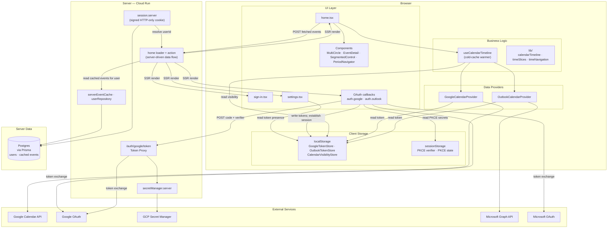

# app runtime stack

Where each piece of code runs, and how data crosses the browser/server boundary.

The server is now the authoritative layer: a signed session identifies the user, and the timeline reads events from a server loader backed by a Postgres event cache. Provider API calls still happen in the browser (OAuth tokens stay client-side); the client warms the server cache by POSTing fetched events to a route action. See [architecture.md](architecture.md) for the layering and [features.md](features.md) for status.

Route modules sit under **Browser** because that is where their components ultimately run; the server's role for them is the one-time SSR render plus executing their `loader`/`action` (the arrow from `home loader + action`).

