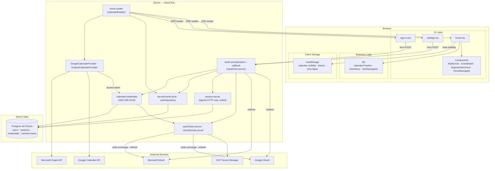

# app runtime stack

Where each piece of code runs, and how data crosses the browser/server boundary.

The server is the authoritative layer: a signed session identifies the user, the server runs the OAuth flows and keeps provider tokens encrypted in Postgres, and the timeline loader reads events through a Postgres event cache, fetching stale windows from the providers itself. The browser holds no provider tokens. See [architecture.md](architecture.md) for the layering and [features.md](features.md) for status.

Route modules sit under **Browser** because that is where their components ultimately run; the server's role for them is the SSR render plus executing their `loader`/`action`.

```mermaid
graph TD
    subgraph Browser["Browser"]
        subgraph UI["UI Layer"]
            signin["sign-in.tsx"]
            home["home.tsx"]
            settings["settings.tsx"]
            comps["Components\nMultiCircle · EventDetail · SegmentedControl · PeriodNavigator"]
        end

        subgraph BLB["Business Logic"]
            lib["lib/\ncalendarTimeline · timeSlices · timeNavigation"]
        end

        subgraph CS["Client Storage"]
            ls["localStorage\ncalendar visibility · theme · time lapse"]
        end
    end

    subgraph CloudRun["Server — Cloud Run"]
        ld["home loader\n(calendarReader)"]
        flow["/auth/:provider/start + callback\n(oauthFlow.server)"]
        sess["session.server\n(signed HTTP-only cookie)"]
        creds["calendarCredentials\n(AES-256-GCM)"]
        sec["serverEventCache · userRepository"]
        dp["GoogleCalendarProvider · OutlookCalendarProvider"]
        oc["oauthClient.server · clientSecrets.server"]
    end

    subgraph Data["Server Data"]
        db[("Postgres via Prisma\nusers · sessions · credentials · cached events")]
    end

    subgraph Ext["External Services"]
        gcal["Google Calendar API"]
        goauth["Google OAuth"]
        gsm["GCP Secret Manager"]
        mggraph["Microsoft Graph API"]
        msoauth["Microsoft OAuth"]
    end

    signin & settings -->|"form POST"| flow
    flow -->|"redirect"| goauth & msoauth
    flow --> oc --> gsm
    oc -->|"code exchange · refresh"| goauth & msoauth
    flow --> sess & sec & creds
    ld -->|"SSR render"| home & settings & signin
    home --> comps & lib
    home -->|"read visibility"| ls
    ld --> sec & dp
    dp -->|"access token"| creds
    creds --> oc
    dp --> gcal & mggraph
    sess & sec & creds --> db
```
